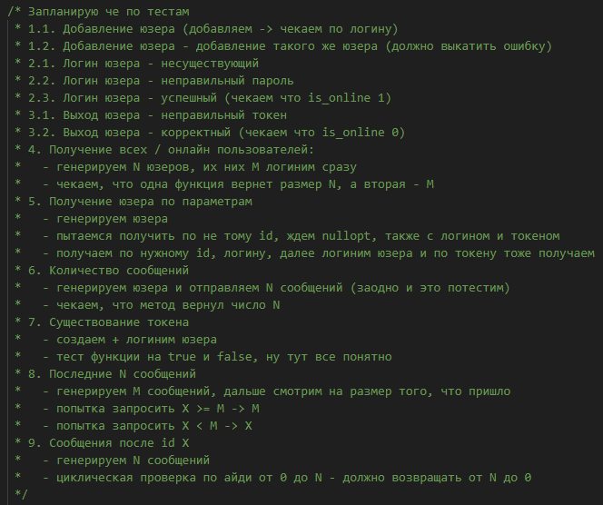

# AUChat (прототип мессенджера)

## Автор
Андрей Усиков, группа 5130904/30102

## Проблема

Пользователям, которым нужно быстро организовать общее текстовое общение **без отвлекающих факторов** в закрытой группе, приходится использовать неподходящие инструменты вроде email-рассылок или социальных сетей, где сообщения теряются в общем потоке и отсутствует структурированный ход беседы. Существующие мессенджеры требуют установки дополнительных приложений и предоставления личных данных, что не всегда приемлемо для рабочих или учебных задач, более того, содержат отвлекающие факторы, что препятствует непрерывному ведению диалога. Это приводит к разрозненности обсуждений, сложностям в отслеживании истории переписки и нарушению контекста общения.

## Выработка требований - пользовательские сценарии

### 1. Регистрация нового пользователя
**Когда** я - новый пользователь, **я хочу** зарегистрироваться в чате с уникальным логином и паролем, **чтобы** получить доступ к общему чату и начать общение с сообществом.

### 2. Вход в систему  
**Когда** я уже зарегистрированный пользователь, **я хочу** войти в систему с помощью своего логина и пароля, **чтобы** продолжить общение в чате и видеть историю сообщений.

### 3. Общение в реальном времени
**Когда** я нахожусь в чате, **я хочу** видеть новые сообщения других пользователей автоматически и отправлять свои, **чтобы** вести плавный и непрерывный разговор.

### 4. Отслеживание активности
**Когда** я общаюсь в чате, **я хочу** видеть кто сейчас онлайн и общую статистику, **чтобы** понимать активность сообщества и чувствовать присутствие других участников.

### 5. Безопасный выход
**Когда** я заканчиваю общение, **я хочу** безопасно выйти из системы, **чтобы** защитить свою учетную запись при использовании на общественных устройствах.

## Архитектура проекта

### Нагрузка на сервис
Учитывая, что мы берем 10000 пользователей в сутки, по опыту общения в чатах на такое число человек можно оценить число одновременно активных пользователей сверху 500 людьми. В таком случае, мы имеем следующие показатели:

#### Соотношение R/W нагрузки
Основную нагрузку на чтение составляет получение истории сообщений, причем этот запрос отправляется от каждого пользователя достаточно часто. Основная нагрузка на запись заключается в отправке пользователями сообщений, что прямо пропорционально числу активных пользователей. Учитывая, что история сообщений проверяется в несколько раз чаще, чем отправляются новые сообщения, можно оценить соотношение нагрузок на чтение и запись как 4 к 1. Таким образом, нагрузки распределены так:

- чтение: 80%
- запись: 20%

#### Объемы трафика
Вводные данные и оценки (взяты сверху исходя из структуры базы данных, размера запросов и статики сайта):
- 50к сообщений в день для 10к пользователей в день
- Объем одного сообщения - 0.5 Кб
- Объем статики, возвращаемой сервером - 0.2 Мб
- Объем одного запроса в среднем - 0.2 Кб, ответа - 3 Кб, запросов всего может быть около 500к
- Объем истории сообщений, показываемой пользователю при входе в чат - 10 Кб, пусть каждый пользователь заходит в чат 20 раз в день
- Объем "подгружаемых" сообщений - 3 Кб, в день таких запросов может быть в районе 300-400к, возьмем 300к

Считаем нагрузку:
- 50к сообщений * 0.5 Кб = 25 Кб в день
- 500к запросов * 0.2 Кб = 100 Мб в день
- 10к пользователей * 0.2 Мб статики = 2 Гб в день
- 200к запросов истории сообщений * 10 Кб = 2 Гб в день
- 300к ответов от сервера * 3 Кб = 900 Мб в день

Итого получаем:
- Входящий трафик на сервис: 125 Мб в день
- Исходящий трафик от сервиса: 4.9 Гб в день
- Суммарно порядка 5 Гб в день

Стоит отметить, что оценки трафика, как и последующие оценки дисковой системы, являются примерными данными, для более реальных данных надо пользоваться бенчмарками трафика, а для более реальных данных дисковой системы - просто использовать сервис какое-то время и посмотреть, сколько дисковой системы занято.

#### Объемы дисковой системы
Оценки памяти для хранения 1 объекта структур (также сверху):
- Сообщения - 0.5 Кб
- Пользователя - 0.2 Кб
- Токенов авторизации - 0.2 Кб

Пускай ежедневно в чате появляются 300 новых пользователей (при той же нагрузке в 10к человек в день), тогда ежедневно требуется 60 Кб на новых пользователей.  
Итак, суммарно памяти в день:
- Сообщения - 25 Мб
- Пользователи - 60 Кб
- Сессии - 3 Мб

Таким образом, за год "накапает" порядка 10 Гб. Периодически можно "чистить" неактивных пользователей - например, тех, кто не заходил в учетную запись больше года - тогда объем дисковой системы будет периодически несколько снижаться.

### Диаграмма на уровне контекста

### Диаграмма на уровне контейнеров

### Контракты

Все API-контракты находятся [здесь](https://cgsgau3.github.io/AUChat-contracts/).  
Ожидаемое время отклика:
- Для запросов авторизации, регистрации - не более 5 секунд
- Для запросов отправки сообщения и получения новых сообщений - не более 5 секунд
- Для загрузки статистики и старых сообщений - не более 3 секунд

### Схема базы данных
  
База данных должна выдержать нефункциональные требования, потому что основная нагрузка на сервис приходится на чтение, а SQLite слаба в операциях записи, на которые нефункциональные требования несколько мягче.

### Схема масштабирования сервиса

#### Вертикальная
Улучшать "железо", используемое сервером - использовать большую вычислительную мощность и большой объем оперативной памяти. Недостаток состоит в дороговизне оборудования и невозможности улучшать бесконечно.

#### Горизонтальная
Будет заключаться в запуске нескольких серверов одновременно (при едином сервисе базы данных), и интеграция в сервис балансировщика нагрузки (здесь подойдет стратегия Round Robin - если число пользователей возрастет в 10 раз, достаточно запустить сервер на 10 разных машинах для возврата к прежней нагрузке).

#### Изменение принципов работы сервиса
- переход от простого SQLite к более сложному, но более эффективному PostgreSQL, тогда можно улучшить нефункциональные требования на время отклика
- отказ от REST API для функций чата и переход на более эффективные WebSocket-ы, которые, к тому же, позволят получать сообщения в реальном времени, а не с интервалом
- добавление системы потоков для лучшего распараллеливания запросов

## Unit-тестирование
Примечание: все тесты будут производиться на модуле базе данных, так как он является основным. Тестировать REST-API эндпоинты в рамках unit-тестирования бесполезная идея, как минимум потому что эндпоинты только дергают методы базы данных и возвращают HTTP-ответ.

### 1. Тесты функциональности добавления пользователя

#### 1.1. Успешное добавление пользователя
**Предусловия**: Пользователь с заданным логином отсутствует в базе данных  
**Действия**: Выполнить метод добавления нового пользователя с валидными данными  
**Ожидаемый результат**: Поиск пользователя по логину возвращает корректные данные пользователя

#### 1.2. Попытка добавления дубликата пользователя
**Предусловия**: Пользователь с заданным логином уже существует в базе данных  
**Действия**: Выполнить метод добавления пользователя с повторяющимся логином  
**Ожидаемый результат**: База данных возвращает ошибку нарушения уникальности логина

### 2. Тесты функциональности аутентификации

#### 2.1. Вход с несуществующим логином
**Предусловия**: Пользователь с указанным логином отсутствует в базе данных  
**Действия**: Выполнить метод входа с несуществующим логином  
**Ожидаемый результат**: База данных возвращает ошибку аутентификации

#### 2.2. Вход с некорректным паролем
**Предусловия**: Пользователь с указанным логином существует в базе данных  
**Действия**: Выполнить метод входа с неверным паролем  
**Ожидаемый результат**: База данных возвращает ошибку аутентификации

#### 2.3. Успешная аутентификация
**Предусловия**: Пользователь с указанным логином существует в базе данных  
**Действия**: Выполнить метод входа с корректными учетными данными  
**Ожидаемый результат**: 
- Возвращается валидный токен доступа
- Флаг is_online пользователя устанавливается в true

### 3. Тесты функциональности выхода из системы

#### 3.1. Выход с некорректным токеном
**Предусловия**: Имеется активная сессия пользователя  
**Действия**: Выполнить метод выхода с невалидным токеном  
**Ожидаемый результат**: База данных возвращает ошибку авторизации

#### 3.2. Корректный выход из системы
**Предусловия**: Пользователь ранее успешно аутентифицирован  
**Действия**: Выполнить метод выхода с валидным токеном  
**Ожидаемый результат**: Флаг is_online пользователя устанавливается в false

### 4. Тесты получения списков пользователей
**Предусловия**: В базе данных зарегистрировано N пользователей, из которых M имеют статус online  
**Действия**:
- Выполнить метод получения общего списка пользователей
- Выполнить метод получения списка онлайн-пользователей

**Ожидаемый результат**:
- Общий список содержит N пользователей
- Список онлайн-пользователей содержит M пользователей

### 5. Тесты поиска пользователя по параметрам
**Предусловия**: В базе данных существует тестовый пользователь с известными credentials  
**Действия и ожидаемые результаты**:
- Поиск по несуществующему ID: возвращает nullopt
- Поиск по несуществующему логину: возвращает nullopt
- Поиск по некорректному токену: возвращает nullopt
- Поиск по валидному ID: возвращает данные тестового пользователя
- Поиск по валидному логину: возвращает данные тестового пользователя
- После аутентификации: поиск по валидному токену возвращает данные пользователя

### 6. Тест подсчета сообщений пользователя
**Предусловия**: Существует пользователь с нулевым счетчиком сообщений  
**Действия**: Отправить N сообщений от имени пользователя  
**Ожидаемый результат**: Метод получения количества сообщений возвращает значение N

### 7. Тест проверки валидности токена
**Предусловия**: Пользователь прошел успешную аутентификацию, получен токен  
**Действия и ожидаемые результаты**:
- Проверка валидного токена: возвращает true
- Проверка невалидного токена: возвращает false

### 8. Тесты получения последних сообщений
**Предусловия**: В базе данных имеется история из M сообщений  
**Действия и ожидаемые результаты**:
- Запрос последних X сообщений при X ≥ M: возвращается M сообщений
- Запрос последних X сообщений при X < M: возвращается X сообщений

### 9. Тест получения сообщений после указанного идентификатора
**Предусловия**: В базе данных сгенерирована последовательность из N сообщений  
**Действия**: Для каждого X от 0 до N выполнить запрос сообщений после ID X  
**Ожидаемый результат**: Для каждого X возвращается (N - X) сообщений

### 10. Тест очищения таблиц базы данных
**Предусловия**: Сгенерировать данные для таблиц сообщений и пользователей
**Действия**: Вызвать метод очистки базы данных  
**Ожидаемый результат**: Таблицы сохранены, все данные из них вычищены, соответствующие методы получения данных вернут пустой массив

### Unit-тестирование - Дневник разработчика

## Интеграционное тестирование
Сделано с помощью библиотеки playwright для node.js. Скрипт реализует пользовательский сценарий №3, но параллельно могут выполняться и другие. В тесте создаются 2 пользовательских контекста, которые регистрируются на сайте и обмениваются парой сообщений. Ожидаемых результатов много, но главный ожидаемый результат - соответствие пользовательскому сценарию №3.

## Сборка
TODO
